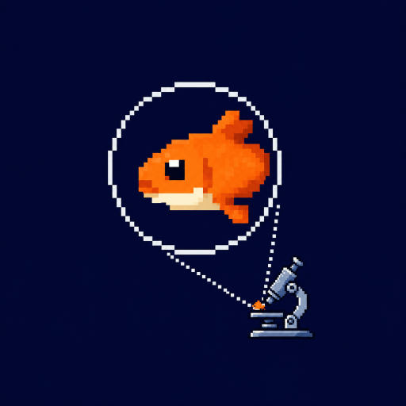

# 🐟 microfish

[中文](README_cn.md)

[](https://pypi.org/project/microfish/) [](https://ghcr.io/vvtommy/microfish) [](LICENSE)

> Free-only MCP gateway for TinyFish — exposes just Search & Fetch, nothing else.


## Why microfish?

|  | Official MCP | microfish |
| --- | --- | --- |
| Search & Fetch (free) | ✅ | ✅ |
| Agent / Browser / Batch (paid) | ✅ exposed | ❌ stripped |
| Agent accidentally calls paid tools | ⚠️ possible | 🚫 impossible |
| API key pool | ❌ | ✅ built-in |
| Rate limit | single key | pooled, higher throughput |
- **🔒 Free-only by design** — Only `search`, `fetch_content`, `get_search_usage`, and `list_fetch_usage` are registered. Paid APIs are never exposed, so agents can't see or invoke them — no accidental charges, no wasted tokens.
- **⚡ Built-in key pool** — Supply multiple TinyFish API keys and microfish round-robins across them. If one key fails, it automatically falls back to the next (up to 3 retries), effectively bypassing single-key rate limits.

## Quick Start

> Get a free API key → https://agent.tinyfish.ai/api-keys
> 

### stdio (recommended)

**Claude Code:**

```bash
TINYFISH_KEYS=<KEY> \
  claude mcp add microfish --env TINYFISH_KEYS -- uvx microfish
```

**Cursor / other MCP clients:**

```json
{
  "mcpServers": {
    "microfish": {
      "command": "uvx",
      "args": ["microfish"],
      "env": { "TINYFISH_KEYS": "<KEY>" }
    }
  }
}
```

### HTTP

```bash
MICROFISH_TRANSPORT=http TINYFISH_KEYS=<KEY> uvx microfish
# endpoint: http://localhost:8000/mcp
```

## Tools

### ✅ Available

| Tool | Description |
| --- | --- |
| `search` | Web search (free) |
| `fetch_content` | Fetch & extract page content (free) |
| `get_search_usage` | Search usage stats |
| `list_fetch_usage` | Fetch usage stats |

### 🚫 Blocked

Agent automation · Batch automation · Browser sessions · Run lifecycle

## Authentication

**1. Client-owned key** — Leave `TINYFISH_KEYS` unset. Each client passes its own key via `Authorization: Bearer`.

**2. Server-managed single key** — Set `TINYFISH_KEYS=<key>`. Optionally set `MCP_AUTH_TOKEN` to protect the endpoint.

**3. Server-managed key pool** ⚡ — Set `TINYFISH_KEYS=k1,k2,k3`. Requests are distributed in order; failures automatically fall back to the next key (up to 3 retries).

## Configuration

| Variable | Default | Description |
| --- | --- | --- |
| `TINYFISH_KEYS` | — | Comma-separated API keys; enables server-managed mode |
| `MCP_AUTH_TOKEN` | — | Bearer token required from clients (server-managed mode) |
| `MICROFISH_TRANSPORT` | `stdio` | `stdio` or `http` |
| `MICROFISH_HOST` | `0.0.0.0` | Bind host (HTTP mode) |
| `MICROFISH_PORT` | `8000` | Bind port (HTTP mode) |
| `MICROFISH_MCP_PATH` | `/mcp` | MCP endpoint path (HTTP mode) |

## Client Examples

- Claude Code
    
    **HTTP:**
    
    ```bash
    # Without auth
    claude mcp add --transport http microfish http://localhost:8000/mcp
    
    # With auth
    claude mcp add --transport http microfish http://localhost:8000/mcp \
      --header "Authorization: Bearer <YOUR_MCP_OR_TINYFISH_TOKEN>"
    ```
    
    **stdio:**
    
    ```bash
    TINYFISH_KEYS=<KEY> \
      claude mcp add microfish --env TINYFISH_KEYS -- uvx microfish
    ```
    
- Codex
    
    **HTTP:**
    
    ```toml
    [mcp_servers.microfish]
    url = "http://localhost:8000/mcp"
    bearer_token_env_var = "MICROFISH_MCP_BEARER"
    ```
    
    Set `MICROFISH_MCP_BEARER` to your TinyFish API key (client-owned) or MCP auth token (server-managed).
    
    **stdio:**
    
    ```toml
    [mcp_servers.microfish]
    command = "uvx"
    args = ["microfish"]
    env = { TINYFISH_KEYS = "<KEY>" }
    ```
    
- Cursor
    
    **HTTP:**
    
    ```json
    {
      "mcpServers": {
        "microfish": {
          "url": "http://localhost:8000/mcp",
          "headers": {
            "Authorization": "Bearer ${env:MICROFISH_MCP_BEARER}"
          }
        }
      }
    }
    ```
    
    Drop the `headers` block if no auth is required.
    
    **stdio:**
    
    ```json
    {
      "mcpServers": {
        "microfish": {
          "command": "uvx",
          "args": ["microfish"],
          "env": { "TINYFISH_KEYS": "<KEY>" }
        }
      }
    }
    ```
    

## Deployment

### Local

```bash
uvx microfish              # run directly, no clone needed
```

### Docker

```bash
docker compose up -d       # pulls ghcr.io/vvtommy/microfish:latest
```

- `docker-compose.yml` — pulls the published image
- `docker-compose_build.yml` — builds from local Dockerfile

<aside>
⚠️

Do not put API keys in compose files. Use environment variables instead.

</aside>

## Contributing

PRs and issues are welcome. Please open an issue first for major changes.

## Releasing

Push a `vX.Y.Z` tag to trigger: PyPI publish + GHCR image publish.

## License

MIT

[Readme（中文）](https://www.notion.so/Readme-177dad355e644f8eb75f7e0c34227d50?pvs=21)